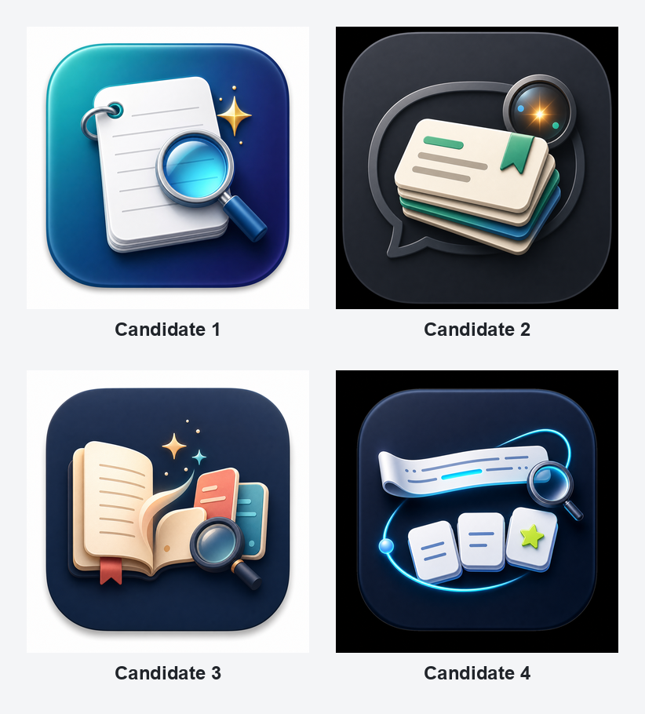

# English Sentence Mining Alfred Workflow



## What It Does

Select an English sentence anywhere on macOS, invoke Alfred Universal Actions or the workflow hotkey, choose the unknown word or phrase, and write a structured card to Anki.

The Anki card contains:

- target word or phrase
- original sentence
- sentence with the target highlighted
- common word meaning
- meaning in this sentence
- full sentence translation
- part of speech
- source and created time

## Installed Pieces

- Tool script: bundled as `english_anki.py` inside the Alfred workflow.
- Alfred workflow: imported into Alfred's workflow preferences folder.
- Runtime cache and pending queue: `~/Library/Application Support/Alfred/Workflow Data/com.dustandlight.english-sentence-mining/`
- Event log: `~/Library/Application Support/Alfred/Workflow Data/com.dustandlight.english-sentence-mining/events.jsonl`

## Main Use

1. Open Anki once. AnkiConnect must be enabled.
2. Open `Configure Workflow` in Alfred and fill `LLM API Key`. The default provider is Groq.
3. Select one English sentence anywhere.
4. Invoke Alfred Universal Actions. Alfred's default selection hotkey is configured in `Alfred Preferences > Features > Universal Actions`.
5. Choose `ew`.
6. Read the sentence translation at the top of the Alfred results, then pick the unknown word or phrase.
7. The card is written to `English::Sentence Mining`.
8. Anki Browser opens to the newly created note so the write is visible immediately.

The workflow uses an OpenAI-compatible API by default:

```text
base_url: https://api.groq.com/openai/v1
model: openai/gpt-oss-120b
```

The model and base URL are editable in Alfred. The API key is not exported with the workflow.

To test the configured provider, run:

```text
ewtest
```

## Install

Download the latest `English-Sentence-Mining-*.alfredworkflow` from GitHub Releases, open it with Alfred, then add your Groq API key in `Configure Workflow`.

Requirements:

- Alfred with workflows enabled
- Anki plus the AnkiConnect add-on
- Groq API key, or another OpenAI-compatible API key/base URL

The workflow icon defaults to candidate 1. The generated alternatives are kept in `assets/icons/candidates/` if you want to swap the icon later.

## Phrase Targets

The list now includes both single-word candidates and short phrase chunks.

Typing the first two letters of a word candidate now starts its contextual meaning preview. Phrase targets also preview from the first non-stopword prefix, such as `li` for `in light of`, capped to keep API calls bounded.

If the exact phrase is not shown, keep the current sentence cached and type a slash query in Alfred:

```text
ew /in light of
```

That creates a one-off target for the current sentence and writes the phrase into the existing Anki `Word` field. The Anki model is intentionally kept unchanged for compatibility; the card is tagged with `target-phrase`.

## Optional Hotkey

The workflow includes a hotkey trigger, but no key is bound by default to avoid collisions.

Set it in:

`Alfred Preferences > Workflows > English Sentence Mining > Hotkey Trigger`

Recommended settings:

- Hotkey: choose your preferred key, for example `Option + E`
- Argument: `Selection in macOS`

After that:

`select sentence -> hotkey -> choose word or phrase -> Anki`

## Manual Fallback

Open Alfred and type:

```text
ew The conceptualization of a Life Operating System has undergone a radical transformation.
```

Then choose the target word or phrase.

## Lookup Quality

By default the workflow uses Groq's OpenAI-compatible API. `ew` displays a cached full-sentence translation at the top of Alfred's results. When the typed query narrows to one exact target, or when using slash mode, it also previews the target meaning before writing to Anki.

Free public dictionary/translation fallback remains enabled. That is useful for testing and for users without an API key, but the `Meaning In Context` field may be less precise.

For higher quality contextual meanings, copy `config.example.json` to `config.json`, then fill:

```json
{
  "llm_api_key": "",
  "llm_base_url": "https://api.groq.com/openai/v1",
  "llm_model": "openai/gpt-oss-120b",
  "llm_timeout_seconds": 25,
  "public_fallback": true,
  "open_browser_after_add": true
}
```

Environment variables are also supported:

```zsh
export GROQ_API_KEY="..."
export GROQ_MODEL="openai/gpt-oss-120b"
```

For another OpenAI-compatible provider, set `LLM Base URL` and `LLM Model` in Alfred's configuration panel.

## Community Sharing

This workflow is safe to share as long as no local credential files are included.

Do not bundle or publish:

- `config.json` if it contains `llm_api_key`
- Alfred exported environment values containing credentials

Other users install the workflow and enter their own API key in Alfred's configuration panel. Their lookups use their own provider account.

## Pending Queue

If Anki is not reachable, the workflow opens Anki and waits briefly. If AnkiConnect is still unavailable, it stores the card in:

`~/Library/Application Support/Alfred/Workflow Data/com.dustandlight.english-sentence-mining/pending_cards.jsonl`

To retry, open Alfred with `ew` and choose `刷新待写入 Anki 的队列`.
